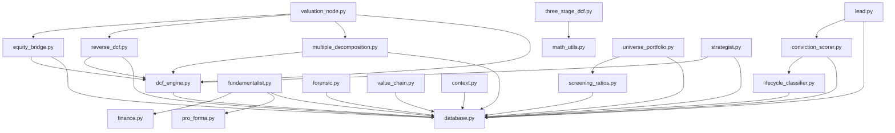

# Calculation Dependencies

This document provides a dependency graph showing how calculation tools and agents interact within the Aletheia pipeline.

## Dependency Graph

## Description of Interactions

*   **`dcf_engine.py`** is the core valuation engine. It is heavily relied upon by `reverse_dcf.py`, `multiple_decomposition.py`, and `equity_bridge.py` to extract intrinsic value baselines and reverse-engineer implied market expectations.
*   **`valuation_node.py`** orchestrates the entire Phase 2 valuation synthesis by combining outputs from `dcf_engine`, `reverse_dcf`, `multiple_decomposition`, and `equity_bridge`.
*   **`database.py`** acts as the central state and cache manager for almost all analytical tools.
*   **`screening_ratios.py`** serves as the provider for universe-level portfolio metrics used by `universe_portfolio.py`.
*   **`conviction_scorer.py`** requires context from `lifecycle_classifier.py` to appropriately gate its thresholds based on the company's maturity.
